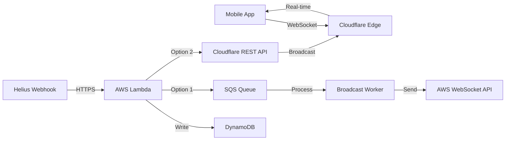

# AWS + Cloudflare Integration Guide

This guide explains how the AWS (SST) backend and Cloudflare Durable Objects work together to provide ultra-low latency WebSocket broadcasting.

## Architecture Overview



## How They Work Together

### 1. **Dual Broadcasting Paths**

Your system supports two broadcasting methods:

**Path A: AWS-Only (Default)**
```
Helius → Lambda → DynamoDB → SQS → Lambda Worker → API Gateway WebSocket
```

**Path B: Edge Broadcasting (Optional)**
```
Helius → Lambda → DynamoDB → Cloudflare Worker → Durable Object → WebSocket Clients
```

### 2. **Decision Point**

The switch happens in your Lambda webhook handler:

```typescript
// source/webhooks/heliusPrice.ts
if (process.env.USE_EDGE_BROADCAST === "true") {
  // Send to Cloudflare
  await fetch(`${EDGE_URL}/broadcast/${token}`, {
    headers: { "Authorization": `Bearer ${SECRET}` },
    body: JSON.stringify(priceData)
  });
} else {
  // Send to SQS
  await sqsClient.send(/* ... */);
}
```

### 3. **Client Connection Options**

Clients can connect to either system:

```javascript
// Option 1: AWS WebSocket
const ws = new WebSocket('wss://abc123.execute-api.us-east-1.amazonaws.com/production');

// Option 2: Cloudflare Edge
const ws = new WebSocket('wss://broadcast.your-domain.com/ws/SOL_TOKEN_ADDRESS');
```

## Step-by-Step Deployment Guide

### Phase 1: Deploy AWS Backend (Required)

```bash
# 1. Clone and setup
cd server
npm install

# 2. Set AWS secrets
npx sst secret set HeliusApiKey YOUR_KEY
npx sst secret set JupiterApiKey YOUR_KEY
npx sst secret set RpcUrl YOUR_RPC_URL

# 3. Deploy to AWS
npm run deploy
```

**Output you'll see:**
```
✓ Complete
  RestApiUrl: https://xyz.execute-api.us-east-1.amazonaws.com
  WebSocketUrl: wss://abc.execute-api.us-east-1.amazonaws.com/production
```

### Phase 2: Deploy Cloudflare Worker (Optional)

```bash
# 1. Navigate to Cloudflare directory
cd cloudflare
npm install

# 2. Login to Cloudflare
npx wrangler login

# 3. Generate webhook secret (save this!)
export WEBHOOK_SECRET=$(openssl rand -base64 32)
echo "WEBHOOK_SECRET: $WEBHOOK_SECRET"

# 4. Configure wrangler.toml
cat > wrangler.toml << EOF
name = "glow-broadcast"
main = "src/index.ts"
compatibility_date = "2024-01-01"

[durable_objects]
bindings = [{ name = "BROADCAST_ROOM", class_name = "BroadcastRoom" }]

[[migrations]]
tag = "v1"
new_classes = ["BroadcastRoom"]

[vars]
ALLOWED_ORIGINS = "https://app.yourdomain.com,http://localhost:3000"

[[routes]]
pattern = "broadcast.yourdomain.com/*"
zone_name = "yourdomain.com"
EOF

# 5. Set the webhook secret
npx wrangler secret put WEBHOOK_SECRET
# Paste the secret when prompted

# 6. Deploy
npm run deploy
```

**Output you'll see:**
```
✓ Deployed glow-broadcast
  https://broadcast.yourdomain.com
```

### Phase 3: Connect AWS to Cloudflare

```bash
# Go back to AWS project
cd ../server

# Set Cloudflare secrets in AWS
npx sst secret set EdgeBroadcastUrl https://broadcast.yourdomain.com
npx sst secret set EdgeBroadcastSecret "YOUR_WEBHOOK_SECRET_FROM_STEP_3"

# Enable edge broadcasting and redeploy
export USE_EDGE_BROADCAST=true
npm run deploy
```

## Configuration Deep Dive

### Environment Variables

**AWS Side (SST):**
```typescript
// Automatically injected by SST
USE_EDGE_BROADCAST: "true" or "false"
EDGE_BROADCAST_URL: "https://broadcast.yourdomain.com"
EDGE_BROADCAST_SECRET: "your-webhook-secret"
```

**Cloudflare Side:**
```toml
# wrangler.toml
[vars]
ALLOWED_ORIGINS = "https://app.yourdomain.com,http://localhost:3000"

# Secrets (set via wrangler secret put)
WEBHOOK_SECRET = "your-webhook-secret"
```

### Security Configuration

1. **Webhook Authentication**: 
   - AWS Lambda includes `Authorization: Bearer SECRET` header
   - Cloudflare Worker validates this header

2. **CORS for WebSockets**:
   - Cloudflare checks Origin header against ALLOWED_ORIGINS
   - Prevents unauthorized WebSocket connections

3. **Connection Limits**:
   - Each Durable Object can handle ~32,000 connections
   - Automatic hibernation when no connections

## Testing Your Integration

### Test 1: Verify AWS Deployment

```bash
# Test health endpoint
curl https://your-api.execute-api.us-east-1.amazonaws.com/health/live

# Expected response:
# {"status":"healthy","timestamp":"2024-01-01T00:00:00.000Z"}
```

### Test 2: Verify Cloudflare Deployment

```bash
# Test health endpoint
curl https://broadcast.yourdomain.com/health

# Expected response:
# {"status":"healthy","timestamp":"2024-01-01T00:00:00.000Z"}
```

### Test 3: Test Webhook → Cloudflare Flow

```bash
# Simulate a webhook from AWS to Cloudflare
curl -X POST https://broadcast.yourdomain.com/broadcast/TEST_TOKEN \
  -H "Authorization: Bearer YOUR_WEBHOOK_SECRET" \
  -H "Content-Type: application/json" \
  -d '{"type":"PRICE_UPDATE","price":123.45,"timestamp":1234567890}'

# Expected response:
# {"success":true,"connections":0}
```

### Test 4: End-to-End WebSocket Test

Create a test HTML file:

```html
<!DOCTYPE html>
<html>
<head><title>WebSocket Test</title></head>
<body>
  <h1>WebSocket Test</h1>
  <div id="status">Disconnected</div>
  <div id="messages"></div>
  
  <script>
    // Connect to Cloudflare edge
    const ws = new WebSocket('wss://broadcast.yourdomain.com/ws/TEST_TOKEN');
    
    ws.onopen = () => {
      document.getElementById('status').textContent = 'Connected';
      console.log('Connected to edge');
    };
    
    ws.onmessage = (event) => {
      const data = JSON.parse(event.data);
      console.log('Message:', data);
      document.getElementById('messages').innerHTML += 
        `<div>${JSON.stringify(data)}</div>`;
    };
    
    ws.onerror = (error) => {
      console.error('WebSocket error:', error);
    };
    
    ws.onclose = () => {
      document.getElementById('status').textContent = 'Disconnected';
    };
  </script>
</body>
</html>
```

Now trigger a price update:

```bash
# Trigger via AWS API (which will forward to Cloudflare)
curl -X POST https://your-api.execute-api.us-east-1.amazonaws.com/webhook/price \
  -H "Content-Type: application/json" \
  -H "x-token: TEST_TOKEN" \
  -d '{
    "type": "PRICE_UPDATE",
    "accounts": [
      {"address": "vault_sol", "nativeBalanceChange": 1000000000},
      {"address": "user", "nativeBalanceChange": -1000000}
    ],
    "txSignature": "test123",
    "slot": 123456,
    "timestamp": 1234567890
  }'
```

You should see the price update appear in your browser console!

## Common Integration Issues

### Issue 1: "Unauthorized" from Cloudflare

**Symptom**: AWS Lambda gets 401 response from Cloudflare

**Fix**: Verify secrets match
```bash
# In AWS project
npx sst secret get EdgeBroadcastSecret

# Should match what you set in Cloudflare
npx wrangler secret list
```

### Issue 2: WebSocket Connection Rejected

**Symptom**: Browser can't connect to Cloudflare WebSocket

**Fix**: Check ALLOWED_ORIGINS in wrangler.toml
```toml
[vars]
# Add your domain and localhost for testing
ALLOWED_ORIGINS = "https://yourdomain.com,http://localhost:3000,http://localhost:8080"
```

### Issue 3: Messages Not Broadcasting

**Symptom**: Webhook succeeds but clients don't receive messages

**Debug Steps**:
```bash
# 1. Check Cloudflare logs
cd cloudflare
npm run tail

# 2. Verify Durable Object is created
npx wrangler durable-objects list

# 3. Check AWS Lambda logs
aws logs tail /aws/lambda/server-production-HeliusPriceWebhook
```

### Issue 4: High Latency

**Symptom**: Messages take > 200ms to arrive

**Fix**: Ensure you're using the nearest Cloudflare region
```javascript
// Check which colo you're connected to
ws.onopen = () => {
  console.log('Connected to:', ws.url);
  // Look for CF-RAY header in network tab
};
```

## Monitoring Both Systems

### AWS Monitoring

```bash
# View Lambda logs
aws logs tail /aws/lambda/server-production-HeliusPriceWebhook --follow

# Check SQS queue depth
aws sqs get-queue-attributes \
  --queue-url YOUR_QUEUE_URL \
  --attribute-names ApproximateNumberOfMessages

# Monitor DynamoDB
aws dynamodb describe-table --table-name server-production-PriceTimeSeriesTable
```

### Cloudflare Monitoring

```bash
# Real-time logs
npx wrangler tail

# Check Durable Objects
npx wrangler durable-objects list

# View metrics in Cloudflare Dashboard
# https://dash.cloudflare.com/ → Workers → Analytics
```

## Performance Comparison

| Metric | AWS Only | AWS + Cloudflare |
|--------|----------|------------------|
| Latency (US) | 100-200ms | 20-50ms |
| Latency (Global) | 200-500ms | 30-80ms |
| Connections/Instance | 1000s | 32,000 |
| Cost at 100K users | ~$1,800/mo | ~$2,000/mo |
| Complexity | Medium | Higher |
| Global Performance | Good | Excellent |

## Rollback Procedures

### To Disable Cloudflare (Fallback to AWS):

```bash
# In AWS project
export USE_EDGE_BROADCAST=false
npm run deploy

# All traffic now goes through AWS
```

### To Re-enable Cloudflare:

```bash
export USE_EDGE_BROADCAST=true
npm run deploy
```

## Best Practices

1. **Start with AWS Only**
   - Get comfortable with the system
   - Verify webhook integration works
   - Monitor costs and performance

2. **Add Cloudflare When**:
   - You have users globally
   - Latency becomes an issue
   - You need > 10K concurrent connections

3. **Use Both Together**:
   - AWS for data storage and processing
   - Cloudflare for real-time delivery
   - This gives you the best of both worlds

4. **Monitor Everything**:
   - Set up CloudWatch alarms for AWS
   - Use Cloudflare Analytics
   - Track end-to-end latency

## Migration Strategies

### Gradual Migration (Recommended)

```typescript
// In your Lambda handler
const useEdge = Math.random() < 0.1; // Start with 10%
if (useEdge && process.env.USE_EDGE_BROADCAST === "true") {
  // Send to Cloudflare
} else {
  // Send to SQS
}
```

### A/B Testing

```typescript
// Route specific tokens to edge
const HIGH_VOLUME_TOKENS = ['SOL', 'BONK', 'WIF'];
const useEdge = HIGH_VOLUME_TOKENS.includes(token);
```

### Regional Routing

```typescript
// Route by user location (requires geo data)
const useEdge = userRegion !== 'us-east-1';
```

## Conclusion

The AWS + Cloudflare integration gives you:
- **Reliability**: AWS handles data persistence
- **Performance**: Cloudflare provides edge delivery
- **Flexibility**: Easy to switch between systems
- **Scalability**: Both systems auto-scale

Start with AWS only, add Cloudflare when you need global low-latency, and enjoy the best of both worlds!

## Quick Reference

### AWS Commands
```bash
npm run deploy                    # Deploy AWS backend
npx sst secret list              # List secrets
aws logs tail FUNCTION_NAME      # View logs
```

### Cloudflare Commands
```bash
npm run deploy                   # Deploy worker
npx wrangler tail               # Stream logs
npx wrangler secret list        # List secrets
```

### Testing Commands
```bash
# Test AWS health
curl https://YOUR_API.execute-api.REGION.amazonaws.com/health/live

# Test Cloudflare health  
curl https://broadcast.yourdomain.com/health

# Test WebSocket
wscat -c wss://broadcast.yourdomain.com/ws/TEST_TOKEN
```

## Deployment Checklist

Use this checklist to ensure everything is properly configured:

### Pre-Deployment
- [ ] AWS CLI configured with proper credentials
- [ ] Node.js 18+ installed
- [ ] Cloudflare account with Workers Paid Plan ($5/month)
- [ ] Domain configured in Cloudflare (for custom routes)

### AWS Deployment
- [ ] All dependencies installed (`npm install`)
- [ ] Helius API key obtained and set
- [ ] Jupiter API key obtained and set
- [ ] Solana RPC URL obtained and set
- [ ] SST deployed successfully (`npm run deploy`)
- [ ] REST API health check working
- [ ] DynamoDB tables created (check AWS Console)

### Cloudflare Deployment (Optional)
- [ ] Wrangler CLI installed (`npm install -g wrangler`)
- [ ] Logged into Cloudflare (`npx wrangler login`)
- [ ] Webhook secret generated and saved
- [ ] `wrangler.toml` configured with your domain
- [ ] ALLOWED_ORIGINS includes your domains
- [ ] Webhook secret set (`npx wrangler secret put`)
- [ ] Worker deployed successfully
- [ ] Health endpoint responding

### Integration
- [ ] EdgeBroadcastUrl secret set in AWS
- [ ] EdgeBroadcastSecret secret set in AWS
- [ ] USE_EDGE_BROADCAST environment variable set
- [ ] AWS redeployed with edge configuration
- [ ] Test webhook successfully reaches Cloudflare
- [ ] WebSocket clients can connect to edge
- [ ] End-to-end price update test passes

### Production Readiness
- [ ] CloudWatch alarms configured
- [ ] Cloudflare Analytics enabled
- [ ] Error logging setup
- [ ] Monitoring dashboard created
- [ ] Rollback procedure documented
- [ ] Team trained on both systems

### Final Verification
- [ ] Price updates flowing correctly
- [ ] WebSocket connections stable
- [ ] Latency meets requirements (< 100ms)
- [ ] Costs within budget
- [ ] All tests passing

Once all items are checked, your integrated system is ready for production! 🚀 